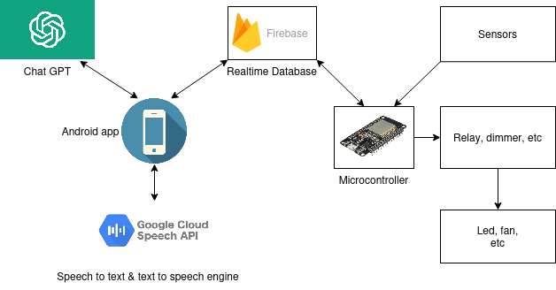
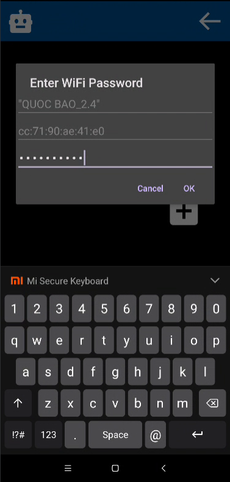
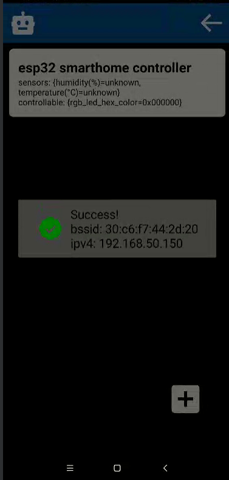

## Used stacks
</img>

## Demo video

https://tranquochuy645.github.io/assets/videos/ChatGPT_smart_home_project/demo_video.mp4

## UI

</img>
</img>
</img>
</img>

## To try it yourself

You will need an OpenAI API key and create a Firebase Realtime Database to run this project.

-  In the Android app folder, add the google_services.json file that Firebase gave you, as their [tutorial](https://www.youtube.com/watch?v=jbHfJpoOzkI) showed. Remember to set the package name to "alexucana," or you will have to change the entire original package name of this application.

-  In the "./android/app/src/main/java/com/example/alexucana" directory, rename example_config.java to config.java and add your API key. You may also change other configurations as you wish.

-  In "./esp32/main/project_config.h," replace the database URL with yours.

